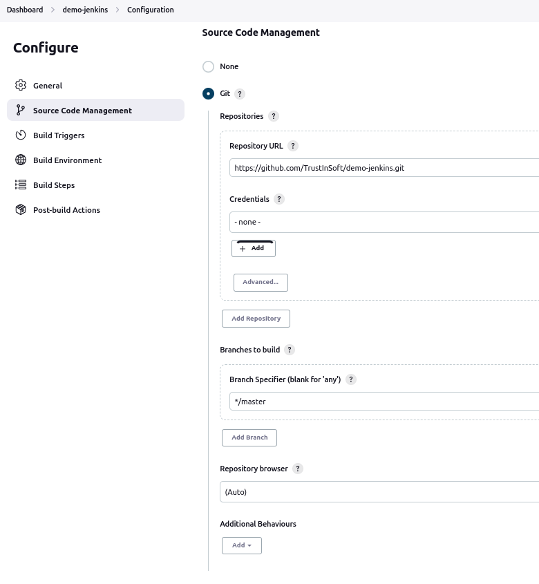

# Demo of **TrustInSoft Analyzer** integration with Jenkins for CI

The purpose of this repository is to demonstrate the possible ways of
integrating TrustInSoft Analyzer in Jenkins CI.

The code used for this demo is the
[Intel tinycrypt library](https://github.com/intel/tinycrypt),
supplemented with a test driver of 10 tests used for the TrustInSoft analysis.

## Setup

You must:

1. Set up a **Jenkins Server** instance.  
   (The objective of this demo is not to explain how to install Jenkins, but
   this is rather simple, and there exists plenty of documentation and
   tutorials available freely on the Internet.
   This is not a formal recommendation, but you may look at
   [_How To Install Jenkins on Ubuntu 20.04_ on DigitalOcean](https://www.digitalocean.com/community/tutorials/how-to-install-jenkins-on-ubuntu-20-04).)
2. Set up a **Jenkins Agent** that runs a version of Ubuntu supported by the
   TrustInSoft Analyzer (18.04, 20.04, or 22.04 as of Dec 2022).
   Note, that the Jenkins server is by default a Jenkins agent, too. So, at
   least for small scale deployment, you may not need to do more than
   installing the Jenkins server.
3. Install the `tis-analyzer` package on the Jenkins agent and configure
   access to a valid license (FlexNet or Node locked).

## Jenkins job configuration

There are different ways of defining Jenkins jobs:

- The most modern and flexible way is through **pipeline** jobs based on
  `Jenkinsfile`.
  The advantage of this approach is that the job configuration itself is
  code, hence all configuration changes can be tracked as any other code
  changes (exactly like the C source code). This is an implementation of the
  _Infrastructure as Code principle_ (**IaC**) - configuration is directly
  stored in the code repository.
- Another solution is to use Jenkins' classic **freestyle** jobs.
  This may also be OK, although it has the drawback that the Job configuration
  is stored in the Jenkins instance itself, and therefore provides little
  traceability of job configuration changes.

Note: In both job examples, we will leverage the [run_all.sh](trustinsoft/run_all.sh)
script that is a convenient way to run all the 10 analyses defined in this
repository. This is a convenience only and absolutely not mandatory for
the jobs. You may just as well run the `tis-analyzer` commands that you want
directly in the job.

### Jenkins job based on pipeline

As per the advantage of Infrastructure as Code, most of the configuration is
defined in the [Jenkinsfile](Jenkinsfile). The only steps to be taken in
Jenkins are:

- Create a Job of kind **Pipeline** or **Multibranch pipeline**.  
  (The main difference is that a multi-branch pipeline will allow to
  conveniently analyze different branches of your code, whereas a pipeline
  is for one branch only.)

### Jenkins jobs based on Freestyle jobs

In this type of job, the configuration is not textual. It's configured in the
Jenkins' GUI itself.
(Jenkins may then store in database and/or XML files, but's that internal)
Configuration is rather self-explanatory. See Jenkins screenshots below:

#### Source Code Management

1. Set **Git->Repositories->Repository URL** to `https://github.com/TrustInSoft/demo-jenkins.git`
2. Click **Add Repository**



#### Build Triggers

1. Choose **Build periodically**
2. Set **Schedule** to `H * * * *`


#### Build Environment

1. Choose **Delete workspace before build starts**
2. Choose **Inject environment variables to the build process**
   1. Set **Properties Content** to `TIS_VERSION=1.44` or whatever version is installed on your Jenkins agent (Can be `1.44.1`, `1.45` or higher in the future).
      If several versions are installed, then chose the one you want to use for your pipeline (if no specific need, it's very recommended to use the latest)


#### Build Steps

1. Insert all the **Build Steps** and **Post-Build Actions**
   Step 1 is obviously mandatory to run the analysis.
   Step 2 is optional yet very recommended to produce the analysis HTML report
   Step 3 is optionel, and to run only if you wish to produce a MISRA report
   
   1. Add step **Execute shell** (1)
      ```
      /home/tis/${TIS_VERSION}/bin/tis-setenv.sh
      source ~/.tis.conf
      # The -n <i> parameter below pertains to the number of analyses you want to run in parallel
      # Benefits: The more analyses you run in parallel, the faster your pipeline
      # Constraints:
      # - You need at least as many token licenses as the number of analyses to run in parallel
      # - You need enough CPU power (cores) and RAM to run the number of parallel analyses yuo have chosen
      trustinsoft/run_all.sh -n 1
      ```
   2. Add step **Execute shell** (2)
      ```
      # This step is to be run to produce the HTML tis-report
      # The parameter passed to tis-report is ALWAYS "_report" unless you changed the default configuration of tis-analyzer 
      /home/tis/${TIS_VERSION}/bin/tis-setenv.sh
      source ~/.tis.conf
      tis-report _results
      ```
   3. Add step **Execute shell** (3)
      ```
      # This step is to be run only if you want a MISRA compliance report
      # The parameter passed to tis-misra is the root directory of the source code ("lib" in te current sample project)
      /home/tis/${TIS_VERSION}/bin/tis-setenv.sh
      source ~/.tis.conf
      tis-misra lib
      ```


#### Post-build Actions

1. Add step **Archive the artifacts**
   1. Set **Files to archive** to  
      `tis_report.html, _results/**.json, _results/**.csv, tis_misra_report/**`


